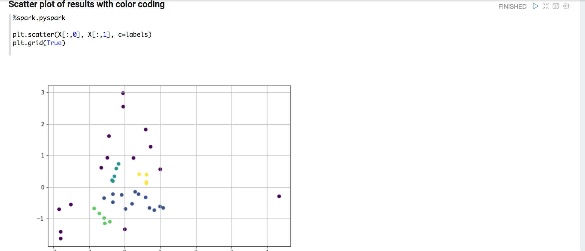

.. Sumo Notebooks documentation master file, created by
   sphinx-quickstart on Fri Jul 20 14:54:02 2018.
   You can adapt this file completely to your liking, but it should at least
   contain the root `toctree` directive.

Welcome to Sumo Notebooks's documentation!
==========================================

Sumo Notebooks provide a way to seamlessly access data stored in Sumo for the purpose of data exploration and statistical analysis. The notebooks provide an interactive way to gain and share insights of a dataset. Built on top of Apache Zeppelin and Jupyter, Sumo Notebooks provide a state-of-the-art user experience coupled with access to the most recent machine learning frameworks such as Apache Spark, tensorflow, etc to unlock the value of machine data.

.. note::  This is an experimental feature under development.

.. toctree::
   :maxdepth: 2
   :caption: Contents:

Getting Started
===============

Sumo Notebooks are organized as a docker container that assembles all dependencies in a single container. This simplifies installing and updating. A Sumo Notebooks container gets access to an organzation's Sumo data store via Sumo's REST API. For that purpose, we require you to create an access key for Sumo as described in `this guide <https://help.sumologic.com/Manage/Security/Access-Keys>`_. After creating access credentials, please follow these steps to install and run the Sumo Notebooks container.

Running the Sumo Notebooks Docker Container
-------------------------------------------

0. Open a shell or terminal on your computer

1. Load the SumoLab docker container on your computer:
``docker pull sumologic/sumonotebooks:latest``

2. Start the container. API access id and access key can be either submitted via the command line or entered via the Spark interpreter configuration menu in Zeppelin.
``docker run -d -it -p 8088:8080 -e ZEPPELIN_SPARK_SUMO_ACCESSID='XXX' -e ZEPPELIN_SPARK_SUMO_ACCESSKEY='XXX' sumologic/sumonotebooks:latest``

3. Open the Zeppelin UI and find some sample notebooks under the 'Notebook' drop down menu.
``http://localhost:8088``

.. note:: It is a prerequisite to have a working `docker <https://docs.docker.com/v17.09/engine/installation/>`_ installed.

This is it, happy coding!

Docker Container Environment Variables
^^^^^^^^^^^^^^^^^^^^^^^^^^^^^^^^^^^^^^

There is a set of environment variables for Sumo Notebooks that can be set when starting the docker container. The ``docker push`` command provides the ``-e`` switch to define these variables.

+-------------------------------+----------------------------------------------------------------------------+
| Variable                      | Description                                                                |						
+===============================+============================================================================+
| ZEPPELIN_SPARK_SUMO_ACCESSID  | Access Id token from Sumo, usually a base64url encoded string.             |
+-------------------------------+----------------------------------------------------------------------------+
| ZEPPELIN_SPARK_SUMO_ACCESSKEY | Access key token from Sumo, usually a base64url encoded string.            |
+-------------------------------+----------------------------------------------------------------------------+
| ZEPPELIN_SPARK_SUMO_ENDPOINT  | A https URL denoting the Sumo deployment to connect to.                    |
+-------------------------------+----------------------------------------------------------------------------+
| ZEPPELIN_SPARK_WEBUI          | This variable controls where the "Spark Job" link in a paragraph points.   |
+-------------------------------+----------------------------------------------------------------------------+

Setting the Access Keys
-----------------------

Sharing access id/key with the Sumo Notebooks container can be done using two methods:

* Submitting ``ZEPPELIN_SPARK_SUMO_ACCESSID`` and ``ZEPPELIN_SPARK_SUMO_ACCESSKEY`` environment variables to the container as shown in the previous section
* Setting or changing the access id/key pair within the Zeppelin web UI as shown below

Step 1
^^^^^^

Click on the username in the right top corner of the Zeppelin web UI. Scroll down or enter ``spark`` in the search bar to get to the Spark configuration page.

.. figure:: images/sumonotebooks_setting-the-accesskey-1.png
    :width: 600px
    :align: center
    :alt: Open the Spark interpreter configuration page

    Open the Spark interpreter configuration page

Step 2
^^^^^^

On the Spark configuration page click the ``edit`` button and then enter access id, access key, and http endpoint in the according text fields. An overview of the Sumo endpoints for the different deployments is listed on `this page <https://help.sumologic.com/APIs/General-API-Information/Sumo-Logic-Endpoints-and-Firewall-Security>`_. Finally, save the configuration and the interprester will restart with the new configuration.

    Enter the access id/key pair and save

Data Science Workflow
=====================

The foundational datastructure for Sumo notebooks is a data frame. A typical data science workflow manipulates data frames in many ways. For instance, data frames might be transformed for feature generation and statistical analysis, or joined with another dataset for enrichment. Therefore, a Sumo notebook returns query results in a Spark dataframe. This enables users to tap into Spark's development universe, or -- using the ``toPandas`` method -- switch over to a python-native approach for data analytics.

Data Exploration using Spark SQL
--------------------------------

This workflow focuses on loading log data from Sumo and then performing data exploration using Spark SQL.

First thing is to instruct Zeppelin to use the Sumo interpreter by entering `%spark.sumo` in the forst line of the paragraph. This annotation indicates that the paragraph is routed to the Sumo interpreter running in the backend. This interpreter checks the query, connects to Sumo using access id and access key and retrieves the data. The data is represented as a `Spark DataFrame <https://spark.apache.org/docs/2.1.0/sql-programming-guide.html>`_ and can be used as such through the name displayed in the DataFrame field. In this example this is ``myquery768``. 

.. note:: In fact it uses a customized version of the `sumo-java-client <https://github.com/SumoLogic/sumo-java-client>`_, therefore it has the same restrictions.

A DataFrame bound to this name exists in the scope of the Spark Scala shell, this is can be manipulated via the Spark Scala API. When sharing the reference through the Zeppelin context, it can also be used in PySpark (see next tutorial). The ``DataFrame`` as also registered as a temporary table in Spark SQL.

	
Starting the paragraph with `%spark.sql` designates the Spark SQL interpreter and SQL queries can be entered to explore the data. This example produces counts from raw data. Counting is a common pre-processing task for subsequent statistical learning task.
	
.. image:: images/3_string-matching.png
    :width: 600px
    :align: center
    :alt: String match operations using Spark SQL

Another common operation on logs is string matching. Spark SQL's `SELECT <https://docs.databricks.com/spark/latest/spark-sql/language-manual/select.html>`_ provides a set of operations to filter and aggregate data.
                         

Clustering Example
------------------

This example is about leveraing the python interpreter to perform a basic clustering operation on metrics data. As usual, `%spark.sumo` leads in a Sumo query. This time a metrics query is submitted. Metrics queries can be specified by selecting _Metrics_ via the drop down menu.

Similarly to the log queries, the result is a `DataFrame`. As this `DataFrame` lives in the Spark Scala world we need to share it via the `Zeppelin context <https://zeppelin.apache.org/docs/0.8.0/usage/other_features/zeppelin_context.html>`_ with the python interpreter

After retrieving the `DataFrame` in the python interpreter and loading it as a pandas data frame, the powerful world python machine learning frameworks opens up! First, some visual exploration using matplotlib reveals is done. 

Next, each time series is featurized to simple (mean, std) pairs and plotted as a scatter plot. Visual inspection reveals that there might be some clusters!

Using this intuition, a first try is to run the dbscan algorithm from the sklearn package.

    
And there we are, yes there are a couple of clusters in the that particular metric.

Troubleshooting
===============

Common Errors
-------------

**No data or exception:**

* Make sure to have the right access credentials in place

**TTransportException or timeout**

* Restart the interpreter: Use black, top right gear for pulling up interpreter menu, then push restart icon on the left of the blue bar listing the interpreter group for spark, finally save on the bottom.

Debugging
---------

The SparkSumoMemoryCache object is a key value store that holds the context of the most recent operations. It can be used to inquire on exceptions and results that are retrieve behind the scenes.

+---------------------------+----------------------------+--------------------------------------------------------------------------+
| Key                       | Type                       | Description                                                              |
+===========================+============================+==========================================================================+
| lastDataFrame             | DataFrame                  | Holds a reference to the last data frame that has been created           |
+---------------------------+----------------------------+--------------------------------------------------------------------------+
| lastLogQueryException     | Exception                  | References the last exception (if any) that the log backend threw        |
+---------------------------+----------------------------+--------------------------------------------------------------------------+
| lastMetricsQueryException | Exception                  | References the last exception (if any) that the log backend threw        |
+---------------------------+----------------------------+--------------------------------------------------------------------------+
| lastMetricsDimensions     | HashMap[String, String]    | Dictionary to resolve the metrics column header to the actual dimensions |
+---------------------------+----------------------------+--------------------------------------------------------------------------+
| lastQueryJob              | JobId                      | References the last job id returned from the search api                  |
+---------------------------+----------------------------+--------------------------------------------------------------------------+
| lastTriplet               | QueryTriplet               | Last processed query                                                     |
+---------------------------+----------------------------+--------------------------------------------------------------------------+
| metricsClient             | SumoMetricsClient          | Client used to retrieve metrics from Sumo                                |
+---------------------------+----------------------------+--------------------------------------------------------------------------+
| sumoClient                | SumoClient                 | Client used to retrieve logs from Sumo                                   |
+---------------------------+----------------------------+--------------------------------------------------------------------------+
| sparkSession              | SparkSession               | Spark session that is used to ingest the data                            |
+---------------------------+----------------------------+--------------------------------------------------------------------------+

Code example
^^^^^^^^^^^^

.. code-block:: scala

   val spark = SparkSumoMemoryCache.get("sparkSession").get.asInstanceOf[SparkSession]

Limitations
-----------

Current limits of the REST API are documented `here <https://help.sumologic.com/APIs/Search-Job-API/About-the-Search-Job-API#Rate_limiting>`_.

Other Documentation
======================

* `Apache Zeppelin Documentation <https://zeppelin.apache.org/docs/0.8.0/>`_
* `HortonWorks: How to diagnose zeppelin <https://community.hortonworks.com/articles/70658/how-to-diagnose-zeppelin.html>`_
* `MapR: Troubleshooting Zeppelin <https://maprdocs.mapr.com/home/Zeppelin/TroubleshootingZeppelin.html>`_
* `Qubole: Debugging Notebook Issues <https://docs.qubole.com/en/latest/user-guide/notebook/debug-notebooks.html>`_

Indices and tables
==================

* :ref:`genindex`
* :ref:`modindex`
* :ref:`search`
